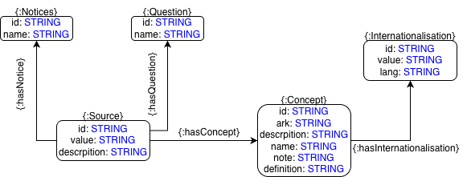
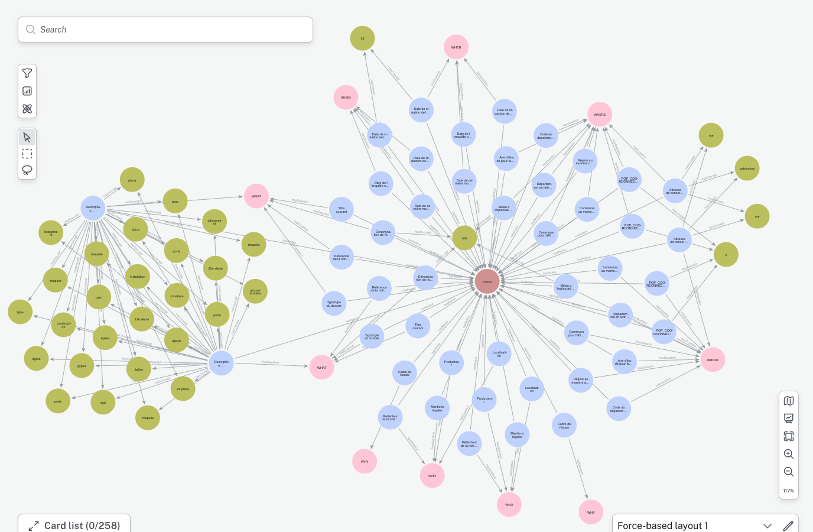

# TT_Linking

This package aims to provide intrinsic and extrinsic linking utilities for data fetched from the 
[POP](https://pop.culture.gouv.fr/) open platform for Cultural Heritage. Specificaly the `merimee`, `palissy`, and `joconde` databases.


## Prerequisites 

An arangoDB instance with thesaurus and notices data fetched through the [TT_ArangoImporter](https://github.com/CNRS-Teatime/TT_ArangoImporter) utility. Optionaly an empty neo4j database to export the results of the linking, the results are stored inside of ArangoDB anyway.

## Installation

Python 3.12 is required.

We recommend using a virtual python environment through the [venv](https://docs.python.org/3/library/venv.html) python package. Simply replace `{foldername}` in the following command with the desired environment name (for ex Debug).
```bash
python3 -m venv {foldername}
```

Then activate the virtual environment :

### Unix/MacOS

```bash
source {foldername}/bin/activate
```

### Windows

```bash
./{foldername}/bin/activate
```

Finaly you can install the dependencies listed in requirements.txt via this command

```bash
python3 -m pip install -r requirements.txt
```

More info here : https://packaging.python.org/en/latest/guides/installing-using-pip-and-virtual-environments/

### Environment

A .env file needs to be created to define the arangoDB and Neo4J address and credentials. An example can be found in the `.env-BOILERPLATE` file. DOC_COLLECTIONS needs to be a string of all document collections that needs to be parsed separated by a coma.

```dotenv
DB_ADDRESS="http://localhost:XXXX"
DB_NAME="NAME"
DB_USER="USER"
DB_PASSWORD="PASSWORD"

NEO4J_URL="neo4j://127.0.0.1:XXXX"
NEO4J_USER="USER"
NEO4J_PASSWORD="PASSWORD"
NEO4J_DATABASE="linking"

DOC_COLLECTIONS="merimee,palissy,joconde"
```

## Usage

If the `.env` file is correct, and the requirements satisfied, running the `main.py` file withour any arguments will start the NLP linking and export the results to neo4J.

```bash
python3 src/main.py
```

## Data storage

In neo4J the results will follow this property graph schema :



Each source is a piece of information, with a value and a description explaining the value, that is linked to a notice, a W7 question it answers and - if found - a thesaurus concept.

With a single notice, the result as visualized in neo4J looks like this :



## Roadmap 

- [ ] Notice to thesaurus concept linking
  - [x] Token based matching
  - [ ] Context based matching
- [ ] Notice to notice linking (Intrinsic linking)
- [ ] Periodo Linking for Temporal information
- [ ] Spatial linking
- [x] Neo4J export